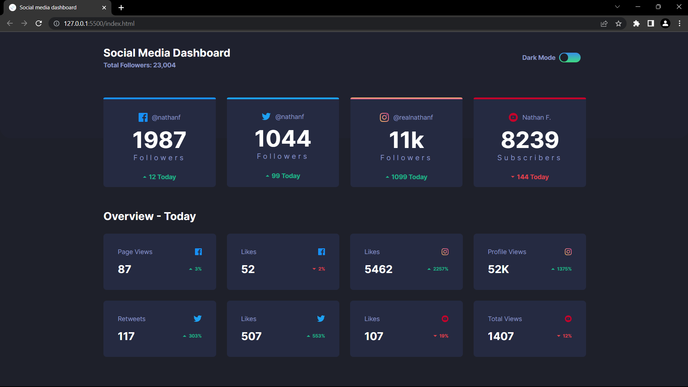

# Frontend Mentor - Social media dashboard with theme switcher

This is a solution to the [Social media dashboard with theme switcher challenge on Frontend Mentor](https://www.frontendmentor.io/challenges/social-media-dashboard-with-theme-switcher-6oY8ozp_H).

## Welcome! 👋

## Table of contents

- [Overview](#overview)
  - [Screenshot](#screenshot)
  - [Links](#links)
- [My process](#my-process)
  - [Built with](#built-with)
  - [What I learned](#what-i-learned)
  - [Useful resources](#useful-resources)
- [Author](#author)

## Overview

### Screenshot

### Links

- Solution URL: [Link](https://github.com/TJ-Shubham/social-media-dashboard)
- Live Site URL: [Link](https://tj-shubham.github.io/social-media-dashboard/)

## My process

### Built with

- Semantic HTML5 markup
- CSS custom properties
- Flexbox
- Grid
- Used media query
- JS DOM

### What I learned

Learn DOM manipulation specially about domcontentloaded. Also learn about toggle.

### Useful resources

- [DOMContentLoaded](https://javascript.info/onload-ondomcontentloaded) - This helped me for understanding of how full HTML source loaded.
- Learn Instance methods [toggle()](https://developer.mozilla.org/en-US/docs/Web/API/DOMTokenList/toggle)

## Author

- Website - [Shubham](https://github.com/TJ-Shubham)
